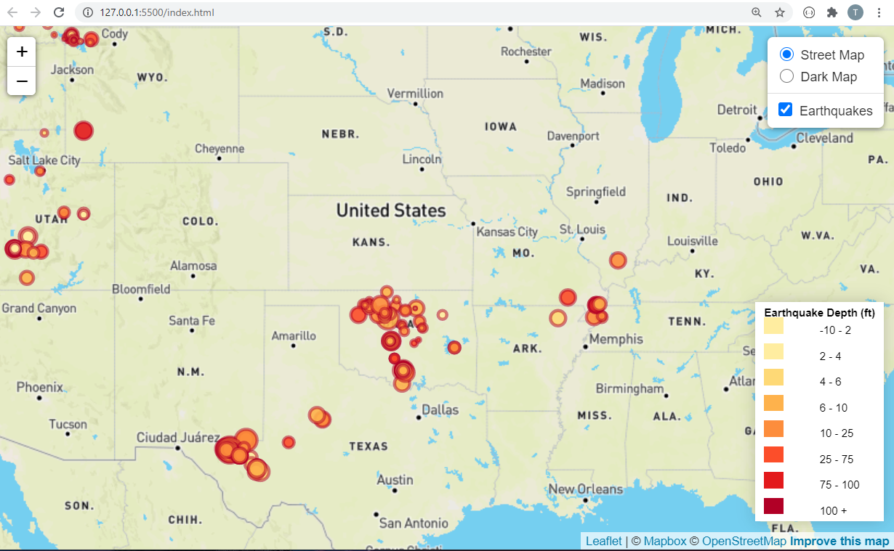
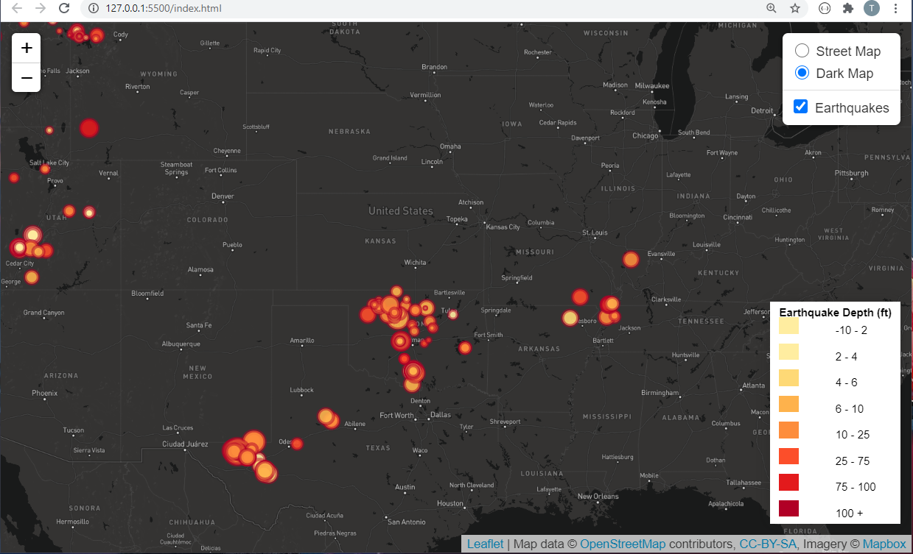
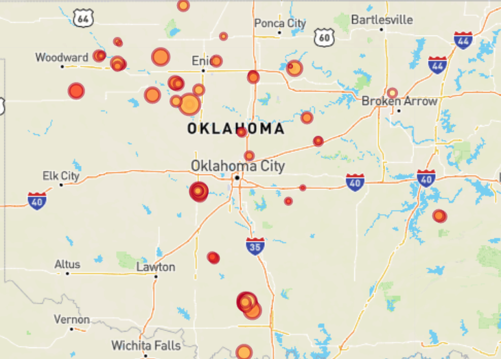
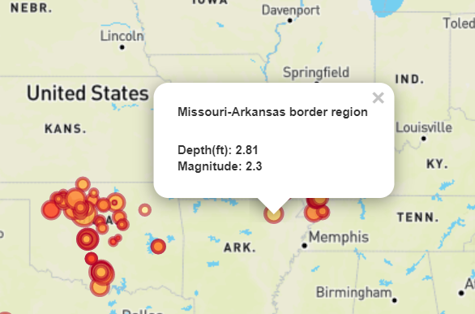
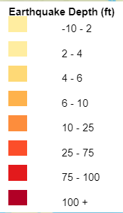

# leaflet-challenge
20210324

This activity is to provide code that will create an interactive map of earthquake locations using using JavaScript, HTML, CSS and Leaflet.

The homework has 2 Levels.  Level 1 is required and Level 2 is Bonus.  Only Level 1 was completed due to time contraints of the Project 2 work.

The browser will not deploy because the file with the API key was not loaded.  

The data set used was for map was a week's worth of earthquake data.  The map has a click feature that allows the user to select a specific point and obtain earthquake related data.  Each circle diameter is relative to the earthquake intensity.  The color of the circle is relative to its depth.  The map also has the ability to switch between Street Map and Dark mode.  Also, there is the ability to toggle off the markers if wanting to view a clean map.  The "+" and "-" in the upper left corner of the map allows for zooming in and out on the map.  The map can also be moved in various directions to view different locations.

The scale increments were selected based on looking at the range of values and splitting them in such a manner as to allow for good color distribution.  The scale increments related to the earthquake depth are: 
  -10 to 2 ft  
  2  - 4 ft  
  4 - 6 ft  
  6 - 10 ft  
  10 - 25 ft  
  25 - 75 ft  
  75 - 100 ft  
  100+ ft  

Links to the code:

HTML code: [HTML Code](index.html) 
JavaScript code: [JavaScript Code](Leaflet-Step-1/static/js/logic.js) 
CSS code: [CSS code](Leaflet-Step-1/static/css/style.css) 

Sample images

Example map view of US in Street Map view  
 
 
Example map view of US in Dark Map view 
 
 
Zoom of map 
 
 
Information box 
 
 
Legend 
 

